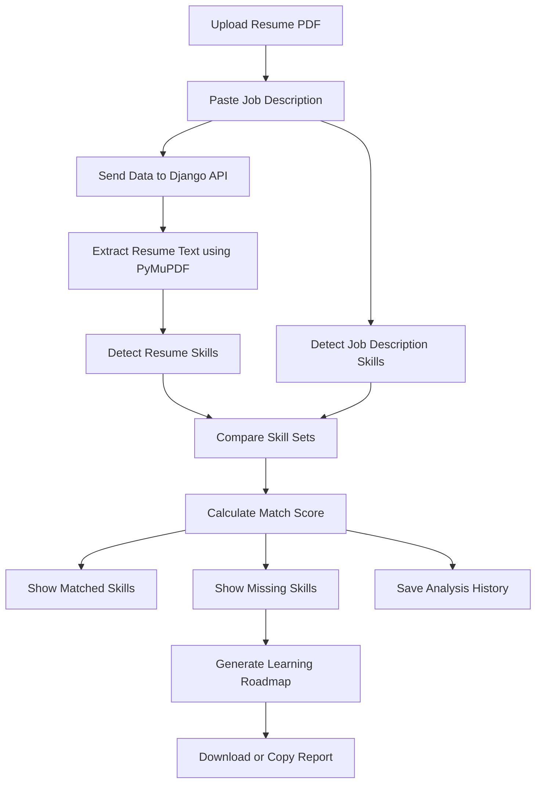
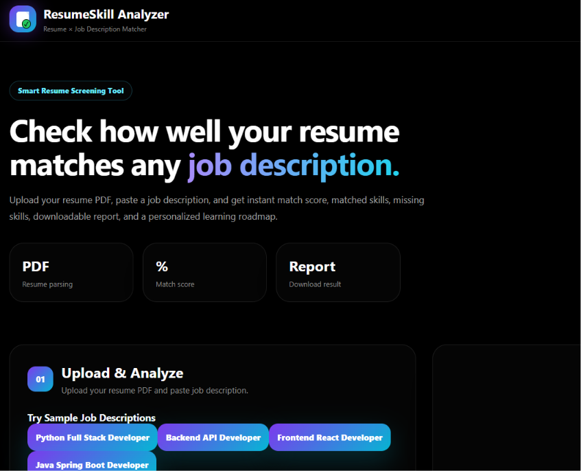
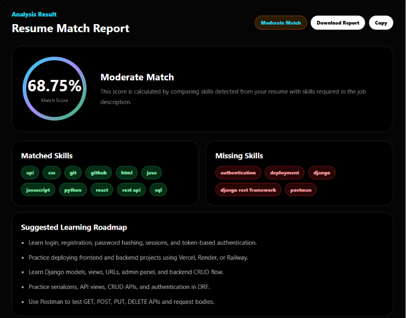
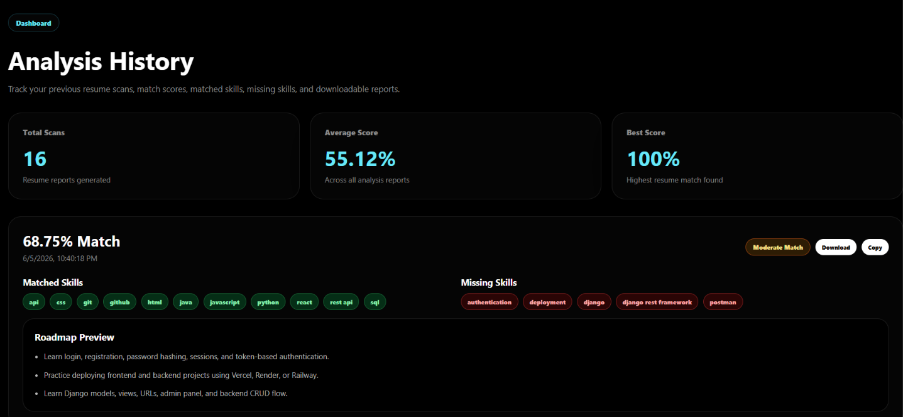
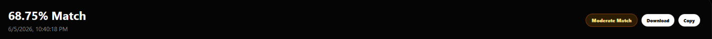
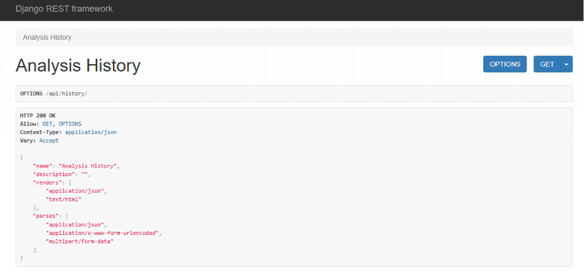

<div align="center">

# 🧠 ResumeSkill Analyzer

### Resume and Job Description Matching Platform

A full-stack web application that analyzes a resume PDF against a job description and generates a match score, matched skills, missing skills, learning roadmap, and downloadable report.

<br />


</div>

---

## 📌 Project Overview

**ResumeSkill Analyzer** helps freshers check how well their resume matches a job description.

The user uploads a resume PDF, pastes a job description, and the system extracts skills from both inputs. It compares them and displays a match score, matched skills, missing skills, and a personalized learning roadmap.

This project is built to demonstrate practical full-stack skills including file upload, PDF parsing, REST API development, React UI, data processing, and dashboard creation.

---

## 🚀 Key Features

| Feature | Description |
|---|---|
| 📄 Resume PDF Upload | Upload resume in PDF format |
| 🧠 Skill Extraction | Extracts technical skills from resume and job description |
| 📊 Match Score | Calculates resume-job match percentage |
| ✅ Matched Skills | Displays skills present in both resume and job description |
| ❌ Missing Skills | Shows skills required by job but missing in resume |
| 🛣️ Learning Roadmap | Suggests what to learn based on missing skills |
| 📜 Analysis History | Stores previous resume analysis reports |
| 📥 Download Report | Downloads resume match report as text file |
| 📋 Copy Report | Copies report content to clipboard |
| 🖤 Modern UI | Black premium dashboard-style frontend |

---

## 🛠️ Tech Stack

### Frontend

- React.js
- JavaScript
- CSS
- Vite

### Backend

- Python
- Django
- Django REST Framework
- PyMuPDF

### Database

- SQLite

---

## 🧩 Project Architecture

```text
ResumeSkillAnalyzer/
│
├── backend/
│   ├── analyzer/
│   │   ├── models.py
│   │   ├── views.py
│   │   ├── serializers.py
│   │   └── urls.py
│   │
│   ├── config/
│   │   ├── settings.py
│   │   └── urls.py
│   │
│   ├── requirements.txt
│   └── manage.py
│
├── frontend/
│   ├── src/
│   │   ├── App.jsx
│   │   ├── App.css
│   │   └── index.css
│   │
│   ├── package.json
│   └── vite.config.js
│
├── .gitignore
└── README.md
```

---

## 🔄 Project Workflow



---

## 🧪 API Endpoints

| Method | Endpoint | Description |
|---|---|---|
| POST | `/api/analyze/` | Analyze resume against job description |
| GET | `/api/history/` | Get previous analysis history |

### Analyze Resume

```http
POST http://127.0.0.1:8000/api/analyze/
```

### Analysis History

```http
GET http://127.0.0.1:8000/api/history/
```

---

## 🖥️ How to Run Locally

### 1. Clone the Repository

```bash
git clone https://github.com/nagasrisai3903/resume-skill-analyzer.git
cd resume-skill-analyzer
```

---

### 2. Run Backend

```bash
cd backend
python -m venv venv
venv\Scripts\activate
pip install -r requirements.txt
python manage.py migrate
python manage.py runserver
```

Backend runs at:

```text
http://127.0.0.1:8000/
```

---

### 3. Run Frontend

Open another terminal:

```bash
cd frontend
npm install
npm run dev
```

Frontend runs at:

```text
http://localhost:5173/
```

---

## 🧾 Sample Job Descriptions

The app includes sample job descriptions for testing:

- Python Full Stack Developer
- Backend API Developer
- Frontend React Developer
- Java Spring Boot Developer

Example:

```text
Looking for a Python Full Stack Developer with skills in Python, Django, Django REST Framework, React, JavaScript, HTML, CSS, SQL, REST API, Git, GitHub, Postman, authentication, and deployment.
```

---

## 📊 Output Example

```text
Match Score: 72%

Matched Skills:
Python, Django, SQL, Git, HTML, CSS

Missing Skills:
React, REST API, Postman, Deployment

Suggested Roadmap:
1. Learn React components, props, state, hooks, and routing.
2. Practice building REST APIs using Django REST Framework.
3. Use Postman to test GET, POST, PUT, DELETE APIs.
4. Practice deploying frontend and backend projects.
```

---

## 📸 Screenshots

### Analyzer Home Page
Modern black theme UI with resume upload, job description input, and sample job description buttons.



---

### Resume Match Result
Displays match score, matched skills, missing skills, detected resume skills, required job skills, and roadmap.



---

### Analysis History Dashboard
Shows total scans, average score, best score, and previous resume analysis reports.



---

### Download and Copy Report
Users can download the analysis report or copy it to clipboard.



---

### Django REST API History
Backend API response showing stored resume analysis history.


```

---

## 🌟 Project Highlights

- Built a full-stack resume analysis platform using Django REST Framework and React.
- Implemented resume PDF parsing using PyMuPDF.
- Created rule-based skill extraction and matching logic.
- Designed a modern black theme dashboard UI.
- Added analysis history with average score and best score tracking.
- Implemented downloadable and copyable resume match reports.

---

## 🔮 Future Enhancements

- User login and authentication
- PDF report generation
- Admin-managed skill database
- Resume improvement suggestions
- Role-based roadmap generator
- Skill gap charts
- ATS-style resume score
- Deployment on Vercel and Render

---

## 👨‍💻 Author

**Nagasrisai Dota**

---

<div align="center">

### ⭐ If you like this project, give it a star on GitHub.

</div>